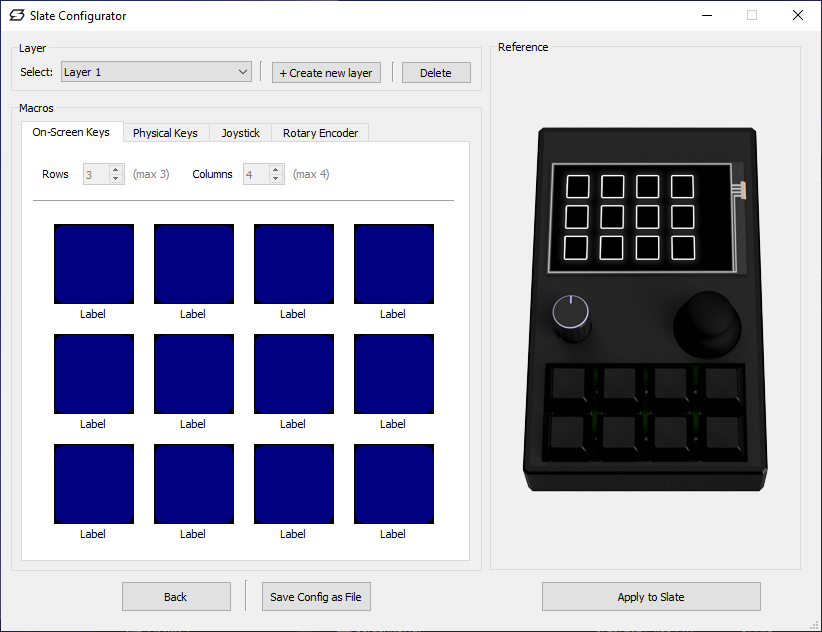

# slate-configurator
This folder contains the development of the Slate desktop app for configuring macro layers.
**.ui** files can be opened using [Qt Designer](https://doc.qt.io/qt-5/qtdesigner-manual.html) and are essentially template files.

Qt Designer UI Files (.ui) are compiled to Python using the command:
`pyuic5 -x <UI_FILE> -o <PYTHON_OUTPUT_FILE>`

Qt Designer Resource Files (.rc) are compiled to Python using the command:
`pyrcc5 <RC_FILE> -o <PYTHON_OUTPUT_FILE>`

